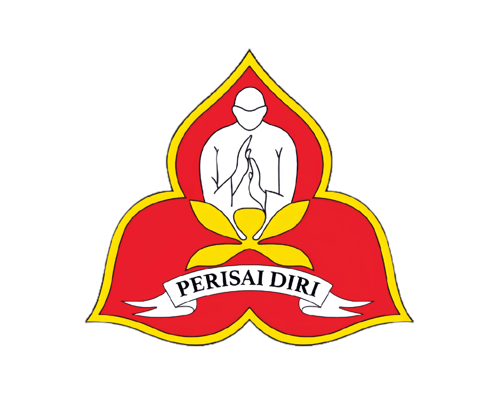

  

<h1 align="center">
  PD-dig (Perisai Diri Digital)
</h1>

  <strong>Sistem Informasi Manajemen Anggota & Event Terintegrasi</strong> 
  <strong>Keluarga Silat Nasional Indonesia Perisai Diri Kabupaten Tasikmalaya</strong>  
  <em>"From Paper to Digital Ecosystem"</em> — Transformasi total manajemen organisasi dari pendataan manual menuju ekosistem digital yang terpusat, valid, dan efisien.

  
  
  
  

---

## 🎯 Latar Belakang & Transformasi

Sebelumnya, manajemen organisasi menghadapi tantangan data yang terfragmentasi:
* **Pendataan Anggota:** Data tersebar di kertas formulir atau file Excel terpisah di setiap ranting, menyebabkan duplikasi dan ketidakvalidan data anggota.
* **Pendaftaran Event:** Peserta harus mengisi formulir berulang kali setiap ada ujian atau kejuaraan.
* **Validasi:** Sulit memverifikasi status aktif anggota secara real-time.

**PD-dig Hadir Sebagai Solusi:**
Bukan sekadar aplikasi tiket, melainkan Platform Manajemen Organisasi (**ERP Sederhana**). Sistem ini menjadikan Profil Anggota sebagai *"Single Source of Truth"*. Data hanya diinput sekali, diverifikasi berjenjang, dan digunakan otomatis untuk pendaftaran event, ujian, hingga penerbitan sertifikat.

---

## 💎 Fitur Unggulan: Manajemen Keanggotaan (Core System)

Sistem ini memiliki *business logic* yang ketat untuk menjamin validitas data anggota.

### 1. Siklus Hidup Verifikasi (Verification Lifecycle)
Menjamin bahwa hanya anggota yang valid yang tercatat di database.
* **Incomplete:** User baru mendaftar, data belum lengkap.
* **Pending:** User melengkapi data profil & memilih Unit Latihan. Data menunggu persetujuan Pelatih.
* **Approved:** Pelatih memvalidasi bahwa user adalah anggota unitnya. **NIA Terbit Otomatis.**
* **Rejected:** Data ditolak (wajib menyertakan alasan) untuk diperbaiki user.

### 2. Snapshot Integrity & Locking
* **Data Consistency:** Jika anggota yang sudah *Approved* mengubah data sensitif (Nama, Tanggal Lahir, Unit), status otomatis reset ke *Pending* untuk diverifikasi ulang.
* **Pre-filled Forms:** Saat mendaftar event, formulir otomatis terisi dari data profil (*Read-Only*). Tidak ada lagi kesalahan penulisan nama di sertifikat.

### 3. Generator Nomor Induk Anggota (NIA) Otomatis
Format unik yang digenerate sistem saat status *Approved*:
* **Format:** `TahunMasuk` + `TglLahir(YYYYMMDD)` + `NoUrut`
* **Contoh:** `201904050001`

---

## 🚀 Fitur Frontend (Publik & Anggota)

Tampilan antarmuka modern dan responsif menggunakan **Tailwind CSS 4**.

### 🏠 Beranda (Homepage) & Informasi
* **Hero Section:** Navigasi cepat ke Direktori Ranting & Pelatih.
* **Portal Informasi (Berita):** Pusat edukasi dan publikasi resmi (Materi Edukasi, Info Pertandingan, Berita Event) yang dikelola melalui CMS.
* **Direktori Anggota & Ranting:** Transparansi data organisasi secara *real-time*.
* **Event Dashboard:** Menampilkan 3 event terbaru secara dinamis.

### 👤 Profil & Dashboard Anggota
* **Manajemen Profil:** Input biodata lengkap (NIK, Pekerjaan, Tingkatan, Unit Latihan).
* **Personalisasi Avatar:** Fitur upload foto profil dengan *real-time preview* berbasis Alpine.js (didukung oleh **Spatie Media Library**).
* **Tiket Saya:** Riwayat transaksi event, status pembayaran, dan unduh E-Ticket.
* **Proteksi Akses:** Hanya anggota berstatus *Verified/Approved* yang dapat mengakses menu transaksi dan direktori internal.

---

## 🎫 Manajemen Event & Ticketing

Sistem pendaftaran event yang terintegrasi penuh dengan data keanggotaan.

* **Pendaftaran Cerdas:** Middleware mencegah user dengan status data tidak valid untuk mendaftar.
* **Metode Pembayaran:**
    * **Online (Midtrans Snap):** QRIS, E-Wallet, VA (Otomatis Lunas).
    * **Tunai/Kolektif:** Konfirmasi manual oleh Admin untuk pembayaran via koordinator.
* **Output Dokumen:** Generate **E-Ticket PDF** dengan QR Code unik dan **Sertifikat Digital** otomatis.

---

## 🛡️ Hak Akses & Panel (Role Management)

Sistem menggunakan **Filament v4** untuk manajemen panel yang efisien:

1.  **Panel Admin (Super Admin):**
    * Manajemen Konten (CMS Berita/Edukasi).
    * **Master Data Dinamis:** Kelola Unit, Tingkatan, dan Jabatan Organisasi secara fleksibel.
    * Dashboard Statistik Penjualan & Anggota.
2.  **Panel Pelatih (Coach Dashboard):**
    * Verifikasi pendaftaran anggota baru di unit masing-masing.
    * Monitoring atlet binaan aktif.
3.  **Panel Scanner (Event Crew):**
    * Validasi QR Code tiket via kamera perangkat untuk presensi event.

---

## 🛠️ Tumpukan Teknologi (Tech Stack)

| Komponen | Teknologi |
| :--- | :--- |
| **Framework** | Laravel 12 |
| **Language** | PHP 8.3 |
| **Admin Panel** | FilamentPHP v4 |
| **Frontend** | Blade + Tailwind CSS 4 + Alpine.js |
| **Database** | MySQL |
| **Payment Gateway** | Midtrans (Snap) |
| **Media Management** | Spatie Media Library |
| **PDF & QR Engine** | DomPDF & Simple-QRCode |

  Dibuat dengan ❤️ untuk kemajuan Perisai Diri Kabupaten Tasikmalaya.

